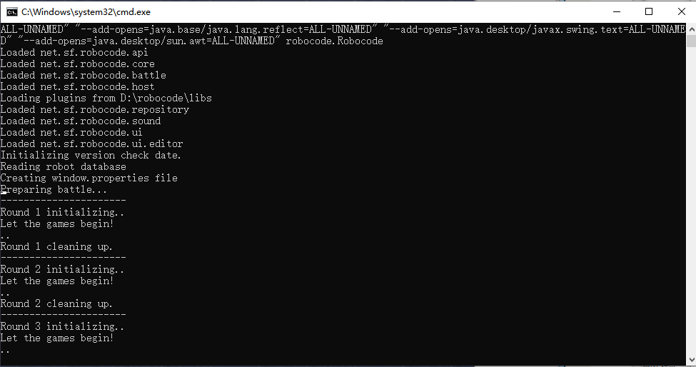

# 一、安装

## 1、下载

https://robocode.sourceforge.io/

robocode-1.9.4.5-setup.jar

## 2、安装

## 3、验证
双击 robocode.bat

# 二、搭配Eclipse下使用

## 1、创建 Java Project；

## 2、选择 Libraries -》Add External JARs...，选择 robocode.jar；

## 3、创建自己的Robot
第一个机器人

'''
package com.my;
import robocode.*; 

public class Robot1 extends Robot
{
    public void run() { 
    while(true) {
        turnGunRight(360); //右转炮管360
        }
    }
    
    public void onScannedRobot(ScannedRobotEvent e) { //当扫描到其它机器坦克时
        ahead(100);   //前进100
        turnLeft(90);  //机器坦克左转90
    }
}
'''

第二个机器人

'''
package com.my;
import robocode.Robot;

public class Robot2 extends Robot{

	public void run() {
		while(true) {
			ahead(100);
			turnGunRight(360);
			
			back(100);
			turnGunRight(360);
		}
	}
}
'''

## 4、在robocode中，配置Options -> Preferences -> Development Options，添加bin目录

